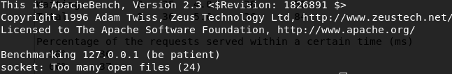
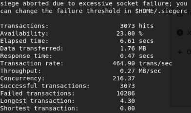
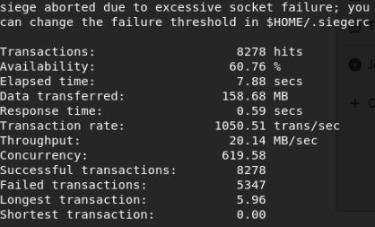
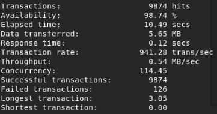
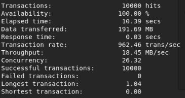

# Tugas1-PAT
### Deskripsi Singkat Tugas
Kami ditugasi mengimplementasikan dan mengukur kinerja simple web server
Tugas ini menggunakan library libevent
Tools pengukuran kinerja yang digunakan adalah Apache Benchmarking Tool dan Siege

## Persoalan Pertama
Terdapat server menggunakan apache atau nginx. Tugas berupa pengukuran kinerja akses file html pada server tersebut.
Kinerja yang diukur adalah berapa waktu respon rerata dan memori yang digunakan pada saat terjadi 1000 concurrent request untuk akses masing-masing 2 file html berbeda. 2 file HTML berbeda tersebut berukuran ~500 bytes dan ~20kB. File berukuran paling kecil bernama tes1.html sedangkan tes2.html berukuran yang paling besar.

### Instalasi NGINX

1) Update informasi repositori Debian:
```
$ sudo apt-get update
```
2) Instalasi package NGINX Open Source:
```
$ sudo apt-get install nginx
```
3) Verifikasi instalasi:
```
$ sudo nginx -v
nginx version: nginx/1.6.2
```

### Hasil Pengukuran Kinerja
Untuk 10000 concurrent request, server apache tidak dapat menanmpung request tersebut.


## Persoalan Kedua
Terdapat server yang harus dibuat dengan pemrograman C++. Server dibuat dengan library low-level. Kami menggunakan library libevent untuk menyelesaikan persoalan tersebut. Server yang dibuat harus diukur kinerjanya sama seperti persoalan pertama.

### Instalasi Libevent
1) Download libevent terbaru:
https://sourceforge.net/projects/levent/files/latest/download

2) Extract arsip
```
$ tar -xzvf libevent*.tar.gz
```

3) Buat makefile:
```
$ cd libevent-2.0.22-stable
$ ./configure --prefix=/opt/libevent
```

4) Kompilasi source code
```
$ make
```
5) Install aplikasi dan clean up
```
$ make install && make clean
```
6) Cek apakah libevent sudah terinstall dengan melihat informasi direktori terkait
```
$ ls -la /opt/libevent
```

### Langkah Menjalankan Server
1) Make Clean terlebih dahulu
```
$ make clean
```
2) Lalu kompilasi dengan make
```
$ make
```
3) Kemudian, jalankan Server
```
$ ./server
```
4) Buka alamat URL berikut untuk membuka file html terkait:
```
http://localhost:8003/tes1
http://localhost:8003/tes2
```
### Kalau Segmentation Fault, Kill Port
1) Lihat port apa yang sedang berjalan
```
$ netstat --listen
```
2) Kalau misalnya port untuk server terpakai, kill port
```
$ fuser -k <port>/tcp
```
***Catatan:*** Port yang dipakai adalah 8083

### Hasil Pengukuran Kinerja
Setelah kami melakukan request sebanyak 10000 concurrent request, ternyata server tidak dapat menampung request tersebut.
Dari server terdapat error sebagai berikut:

Dari apache benchmarking tool, error yang tampil adalah sebagai berikut ketika mengakses kedua file:


Dari siege, error yang tampil adalah sebagai berikut:
a) akses tes1.html 10000 concurrent request (~500 bytes)<br>

<br>b) akses tes2.html 10000 concurrent request (~20 kB)<br>


Namun, akses kedua file html tersebut dengan 1000 concurrent request mungkin dilakukan.

a) akses tes1.html 1000 concurrent request (~500 bytes)
#### Apache Benchmarking Tool
```
This is ApacheBench, Version 2.3 <$Revision: 1826891 $>
Copyright 1996 Adam Twiss, Zeus Technology Ltd, http://www.zeustech.net/
Licensed to The Apache Software Foundation, http://www.apache.org/

Benchmarking 127.0.0.1 (be patient)


Server Software:        
Server Hostname:        127.0.0.1
Server Port:            8003

Document Path:          /tes1
Document Length:        600 bytes

Concurrency Level:      1000
Time taken for tests:   1.883 seconds
Complete requests:      50000
Failed requests:        48662
   (Connect: 0, Receive: 0, Length: 48662, Exceptions: 0)
Keep-Alive requests:    50000
Total transferred:      6155476 bytes
HTML transferred:       802800 bytes
Requests per second:    26559.62 [#/sec] (mean)
Time per request:       37.651 [ms] (mean)
Time per request:       0.038 [ms] (mean, across all concurrent requests)
Transfer rate:          3193.11 [Kbytes/sec] received

Connection Times (ms)
              min  mean[+/-sd] median   max
Connect:        0    0   3.1      0      43
Processing:     9   36   3.8     37      43
Waiting:        0   36   3.8     37      43
Total:          9   37   3.3     37      57

Percentage of the requests served within a certain time (ms)
  50%     37
  66%     38
  75%     38
  80%     38
  90%     40
  95%     41
  98%     41
  99%     49
100% 57 (longest request)
```
#### Siege


b) akses tes2.html 10000 concurrent request (~20 kB)
#### Apache Benchmarking Tool
```
This is ApacheBench, Version 2.3 <$Revision: 1826891 $>
Copyright 1996 Adam Twiss, Zeus Technology Ltd, http://www.zeustech.net/
Licensed to The Apache Software Foundation, http://www.apache.org/

Benchmarking 127.0.0.1 (be patient)


Server Software:        
Server Hostname:        127.0.0.1
Server Port:            8003

Document Path:          /tes2
Document Length:        20100 bytes

Concurrency Level:      1000
Time taken for tests:   1.963 seconds
Complete requests:      50000
Failed requests:        49105
   (Connect: 0, Receive: 0, Length: 49105, Exceptions: 0)
Keep-Alive requests:    50000
Total transferred:      23343080 bytes
HTML transferred:       17989500 bytes
Requests per second:    25466.03 [#/sec] (mean)
Time per request:       39.268 [ms] (mean)
Time per request:       0.039 [ms] (mean, across all concurrent requests)
Transfer rate:          11610.46 [Kbytes/sec] received

Connection Times (ms)
              min  mean[+/-sd] median   max
Connect:        0    0   2.9      0      40
Processing:     9   38   5.1     38      87
Waiting:        0   37   3.3     38      48
Total:         10   38   4.6     38      87

Percentage of the requests served within a certain time (ms)
  50%     38
  66%     38
  75%     39
  80%     39
  90%     40
  95%     41
  98%     52
  99%     60
100% 87 (longest request)
```
#### Siege

